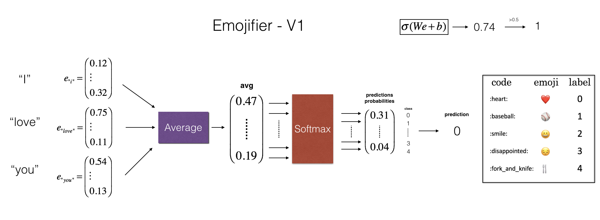

# Emoji generation

In this project we implemented a model which inputs a sentence and finds the most appropriate emoji to be used with the sentence. The input sentence is first classified on the basis of the sentence's sentiment which later helps in finding the appropriate wmoji to be used with that sentence.
For example:

**Input:** <i>Lets get coffee and talk.</i>

**Output:**(☕️)

We have used the pretrained glove embedding matrix of size (400000, 50). It means, the matrix have the embeddings for 4,00,000 words and each word embedding is a vector of length 50. Using the embeddings we saw that even if we have used the small training set our algorithm will be able to generalize and associate words in the test set to the same emoji even if those words don't appear in the training set. 

### Dataset Used

We have a tiny dataset (X, Y)

- X contains 188 sentences (strings)
- Y contains a integer label between 0 and 4 corresponding to an emoji for each sentence

Out of which we have used 132 for training our model. And 56 labeled strings for the testing purpose. 

In this project we have worked on two ways to generate emoji. First model is our baseline model( i.e. ***emoji_gen.ipynb***) where we converted every single sentence into its embedding representation form( i.e. every word in a sentence will be represented in a vector of size 50). And then, we have averaged on every word embedding vector in a sentence and train this on softmax classifier.

<caption>
 <strong>Figure 2:</strong> Baseline model.
</caption>

In this Second Model( i.e ***emoji_gen_lstm.ipynb***) we have used LSTM to build such approach. W irst converted every sentence into their corresponding embedding word vectors then trained the model. We provided each input word to a particular LSTM cell. The LSTM cell then passed its activation value (its learning) to the next LSTM cell in the same layer and to the next LSTM layer. 

Here we have used 2 layers of LSTM. Layer parameters for the first LSTM layer is ***LSTM( 128, return_sequence = True)*** and for second LSTM layer is ***LSTM( 128, return_sequence = False)***. We have used dropout as a regularization technique which reduces overfitting of the training data by spreading out the weights over the network.

Final is the softmax layer for output( i.e. sentence classification). We have used a function ***label_to_emoji()*** which uses the keras emoji library to automatically convert the integer label to its corresponding emoji.

  

<caption>
 <strong>Figure 3:</strong> A 2-layer LSTM sequence classifier. 
</caption>

LSTM model is better over the baseline model(i.e. where we train the softmax on the averaged word embedding vectors) because the baseline model is trained only on the basis of the word sentiment in the sentence. Rather, it should also pay emphesis on the word sequence used in the sentence. This problem gets solved in LSTM model. For example,

<b><u>For Baseline Model:</u></b>

<i><b>Input: </b></i> <i>Not feeling happy.</i>

<i><b>Output: </b></i>(😄)

<b><u>For LSTM Model:</u></b>

<i><b>Input: </b></i> <i>Not feeling happy.</i>

<i><b>Output: </b></i>(😞)